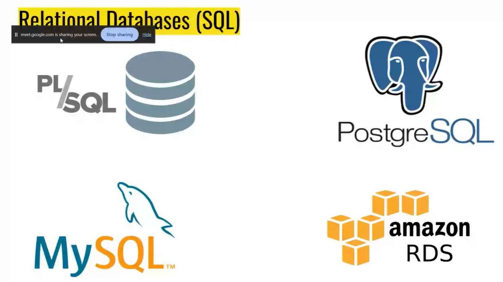

## Database

## Linux

- free
- Open-source

- destroys --> alphine is generally used in linux flavour

## Scaling

in company we use both which is cheaper these both are scaling methods

### Auto Scaling

aws or pc rent provider will atomatically sell or rent pc on basis of usage pay as usage

#### Dos

to check the traffic is real or malicious taffic to stay safe from malicious traffic we can block the forigen ip and use capthua

to run any program or offline game the hdd will copy the data and copy it to ram to run the program because ram is 10,000 x than hdd

# SQL

### Types os SQL

