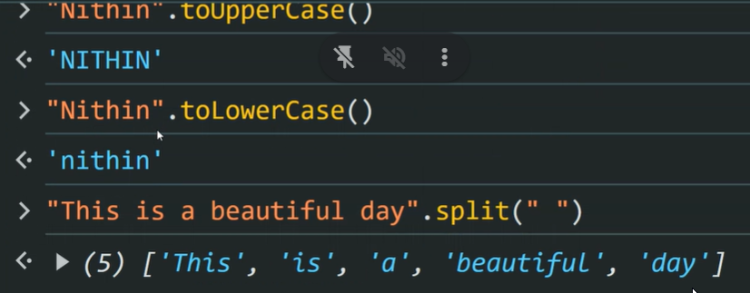

## Object Methods

- Object.keys();
- Object.values();

## Shortcuts

- 'ctrl + space' -> Autocomplete
- 'ctrl + /' -> comment
- 'win + .' -> emojis
- ctrl +
- ctrl + shift + p ->all shortcuts

## Template Literal

- interpolation(substitute)

```js
const movieUrl = (domain, genre, year) =>
  `http://${domain}?genere=${genre}&year=${year}`;
console.log(movieUrl("imdb.com", "thriller", 2020));
```

- supports multiline string

- refactor -> Quality better & functionality same

- Array destructuring
  - only if value is undefined the aonly we can asign value
  ```js
  const [t1, t2, t3 = 80] = [100, 200];
  ```
  - in above case it can t3 can only be assign becaue it was undefined
- 

- holes
  

## Object Destructuring

- in object destructuring it match the address not the index value
- ## Default Value
  - can be string ,index ,or symbol also  
    

## ES6+ features

- 
- 

## Ternary Operators

```js
5 > 4 ? "Asesome" : "cool";
```

## Binary Operators

- Arithmetic +,-,/,\*
- logical &&,||
- Relational >,<,>=,=,

## Unary operators

- ++ , --
- !

## Truthy vs Falsy

```js
let x = "cool";

if (x) {
  console.log("hey");
} else {
  console.log("nope");
}
```

- [Falsy Table](https://developer.mozilla.org/en-US/docs/Glossary/Falsy)

- rest operator
  

- rest operator is in left and spread operator in right

- split operator
  

- join
  

- split every char
  
